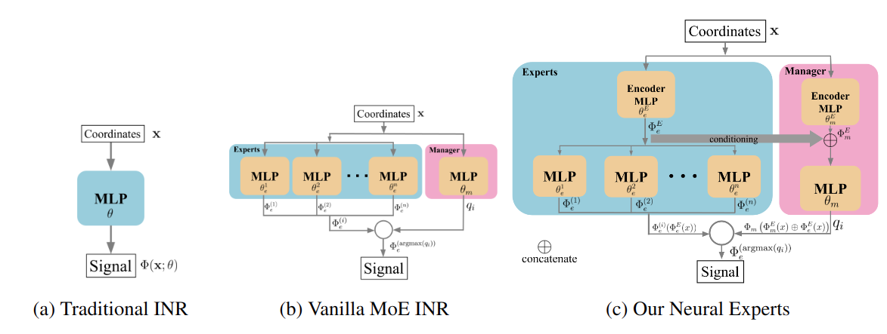

***Neural Experts***: Mixture of Experts for Implicit Neural Representations (NeurIPS 2024)
---
Created by [Yizhak Ben-Shabat (Itzik)](http://www.itzikbs.com)*, [Chamin Hewa Koneputugodage]( https://www.linkedin.com/in/chamin-hewa-koneputugodage-b3ba17148/)*, [Sameera Ramasinghe](https://www.linkedin.com/in/sameeraramasinghe/) and [Stephen Gould](http://users.cecs.anu.edu.au/~sgould/) from [ANU](https://www.anu.edu.au/).

__[Project page](https://sitzikbs.github.io/neural-experts-projectpage/)&nbsp;/ [Arxiv](https://arxiv.org/abs/2410.21643)&nbsp;/ [Video](https://youtu.be/mmxTBAZYYys)__

<div align="center">
  <a href="https://www.itzikbs.com/" target="blank">
    
  </a>
  <a href="https://www.linkedin.com/in/chamin-hewa-koneputugodage-b3ba17148/" target="blank">
    
  </a>
  <a href="https://www.linkedin.com/in/sameeraramasinghe/" target="blank">
    
  </a>
  <a href="https://cecs.anu.edu.au/people/stephen-gould/" target="blank">
    
  </a>
</div>
* Equal contribution



## Introduction
This is the code for training and evaluating Neural Experts for various implicit neural representations including images, audio, and SDFs representing 3D surfaces.
The repo is very versatile and allows to easily select different architecture configurations, training parameters, and datasets through the `config.yaml` files.

Please follow the installation instructions below.

## Instructions

### 1. Requirements

The code was tested with Python 3.8.19, torch 2.1.2, CUDA 11.8 on Ubuntu 22.04. 
Note that our experiments show that different environments can affect the results.

For a full list of requirements see [`requirement.txt`](requirements.txt). 

Example installation code (should install PyTorch separately):
```sh
conda create -n inr_moe python=3.8.19
conda activate inr_moe
conda install pip
pip install torch==2.1.2 torchvision==0.16.2 torchaudio==2.1.2 --index-url https://download.pytorch.org/whl/cu118
pip install -r requirements.txt
```

### 2. Data and logging
We recommend placing the data you want to encode in the `data` directory however, this is not strictly required, as long as you make sure that the config file points to the correct `dataset_path` (under `DATA`).
The specific file if is given as a parameter for the relative path from the `data` directory for the train and test script.

For RGB images, we provide a script to save images from `skimage` locally in the `data` directory for rapid experimentation.
If you want to reproduce the resutls in the paper, you will need to download the [KODIM](https://r0k.us/graphics/kodak/) dataset.


###  3. Train and Testing on audio signals
Run the following script to train and test on audio signals:
```sh
cd audio
./run_train_test_audio.sh
```
This will train a neural representation for audio signals and evaluate the reconstruction error. 
The script uses the configuration file `./configs/audio_config.yaml` which can be modified to change the training parameters.


### 4. Train and test on images
Run the following script to train and test on RGB images:
```sh
cd image_reconstruction
./run_train_test_rgbimage.sh
```

### 4. Train and test on 3D SDFs
To download the data for 3D SDFs first run
```sh
cd data/sdf_3d/
./download_3d_data.sh
cd ../..
```
Run the following script to train and test on 3D SDFs:
```sh
cd surface_reconstruction
./run_train_test_3d_sdf.sh
```

## Thanks
We build on top of several related code bases and thank their authors for their work: 
* [DiGS](https://github.com/Chumbyte/DiGS)
* [SIREN codebase](https://github.com/vsitzmann/siren)


## License and Citation

If you find our work useful in your research, please cite our paper:

[Paper](https://arxiv.org/abs/2410.21643):
```bibtex
@inproceedings{ben2024neuralexperts,
  title={Neural Experts: Mixture of Experts for Implicit Neural Representations},
  author={Ben-Shabat, Yizhak and Hewa Koneputugodage, Chamin and Ramasinghe, Sameera and Gould, Stephen},
  booktitle={Advances in Neural Information Processing Systems (NeurIPS},
  year={2024}
}
```

See [LICENSE](LICENSE) file.
